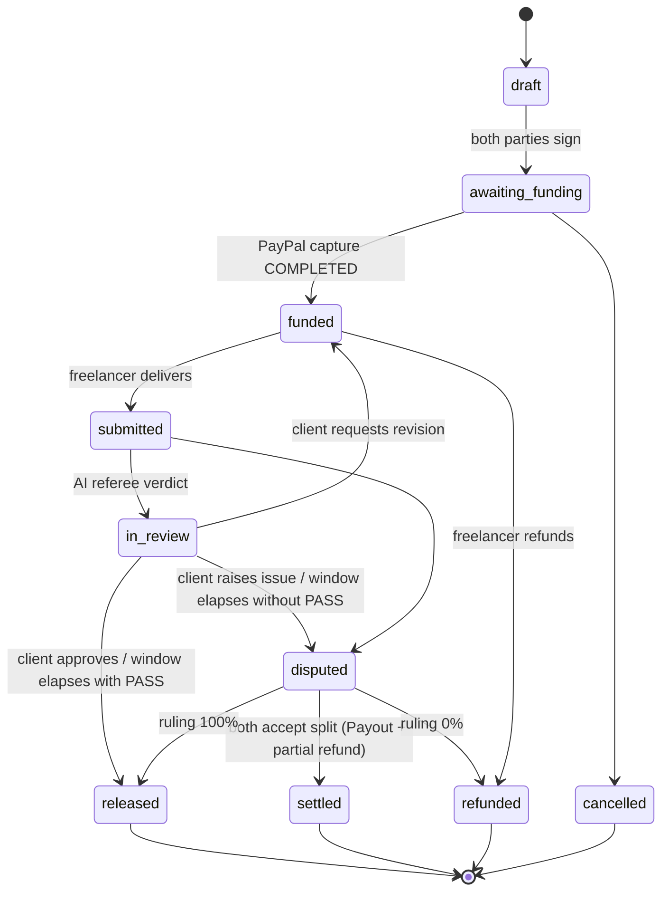
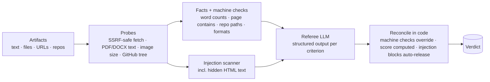

# Kept ;  architecture & design notes

This document explains how Kept moves money safely and how the AI is kept honest. For setup see the [README](../README.md).

## 1. The escrow state machine

Every milestone moves through an explicit state machine ([`src/lib/domain/state.ts`](../src/lib/domain/state.ts)). Each money-moving action is a transition, and each transition is applied with a **compare-and-set** update (`UPDATE milestones SET status = … WHERE id = … AND status IN (…)`, see `casMilestone` in [`context.ts`](../src/lib/domain/context.ts)). If two actors race ;  the client clicking *Approve*, the sweeper auto-releasing, a webhook retry ;  exactly one wins and the others fail cleanly.

## 2. PayPal integration

| Step | API | Idempotency / safety |
|---|---|---|
| Fund | `POST /v2/checkout/orders` (Server SDK `OrdersController.createOrder`) | `PayPal-Request-Id`; unique `invoice_id`; `custom_id` = milestone id |
| Capture | `POST /v2/checkout/orders/{id}/capture` | `PayPal-Request-Id`; `ORDER_ALREADY_CAPTURED` → read the order instead; amount and `custom_id` verified before booking |
| Release | `POST /v1/payments/payouts` | `sender_batch_id = kept-<milestone>` ;  PayPal rejects duplicates for 30 days |
| Refund / split | `POST /v2/payments/captures/{id}/refund` (Server SDK `PaymentsController.refundCapturedPayment`) | `PayPal-Request-Id = kept-refund-<refund row>` |
| Reconcile | `GET /v1/payments/payouts/{batch}` | sweeper refreshes in-flight items |
| Webhooks | `POST /v1/notifications/verify-webhook-signature` | event id stored with a unique index; unverified deliveries get a 401 and are not recorded; a redelivery of an event whose first attempt failed is processed again |
| Payer disputes | `CUSTOMER.DISPUTE.*` webhooks → `POST /v1/customer/disputes/{id}/provide-evidence` | auto-release frozen while open; evidence submitted once |
| Identity | `/signin/authorize` → `/v1/oauth2/token` → `/v1/identity/oauth2/userinfo` | OAuth `state` cookie; verified payer id stored for payouts |

**Self-healing checkout.** If the buyer approves in the PayPal popup and then closes the tab before the browser calls *capture*, PayPal's `CHECKOUT.ORDER.APPROVED` webhook makes the server capture it anyway. If the browser *did* capture, the webhook is a no-op.

**Seeded vs. live money.** Demo worlds are pre-populated with history funded through an in-process PayPal simulator (`payments.simulated = true`); every payment a visitor makes afterwards goes through the real PayPal sandbox. `gatewayFor(payment)` routes refunds and payouts through the same rail that funded the escrow, so the books always reconcile.

## 3. The double-entry ledger

[`ledger.ts`](../src/lib/domain/ledger.ts) refuses to post a journal whose lines don't net to zero. Amounts are integer cents; positive = debit.

| Event | Journal |
|---|---|
| Capture of $320.37 for a $300 milestone | Dr `paypal_cash` 32037 · Cr `escrow_liability` 30000 · Cr `fee_revenue` 870 · Cr `processing_collected` 1167 |
| PayPal's actual fee (from `seller_receivable_breakdown`) | Dr `processing_expense` · Cr `paypal_cash` |
| Payout to freelancer | Dr `escrow_liability` · Cr `paypal_cash` |
| Payout fee | Dr `payout_expense` · Cr `paypal_cash` |
| Refund to client | Dr `escrow_liability` · Cr `paypal_cash` |

Invariant checked in the ops console: **−escrow_liability = Σ amount of milestones currently holding funds.**

Pricing gross-up ([`fees.ts`](../src/lib/domain/fees.ts)): `total = ceil((milestone + kept_fee + 0.49) / (1 − 0.0349))`, so after PayPal's standard US rate escrow still holds the full milestone and the freelancer receives 100%.

## 4. The AI layer ;  "code measures, the model judges"

- **Contract compiler** ([`drafter.ts`](../src/lib/ai/drafter.ts)) ;  converts a DM/description into a `PactInput`: milestones, criteria with optional machine checks, terms, ambiguities, risk flags, clarity score. Output is validated with Zod and normalised (clamped numbers, currency) before anyone sees it.
- **Referee** ([`referee.ts`](../src/lib/ai/referee.ts)) ;  receives the contract, verified probe facts, machine-check outcomes, extracted text and images. Deliverables are wrapped in `<deliverable>` tags and declared untrusted. `reconcile()` then:
  - downgrades any "met" whose machine check failed;
  - computes the score from per-criterion results (met = 1, partial = 0.5, cannot-verify = 0.75, not met = 0);
  - sets `pass` only when everything material is met;
  - marks injection if either the model *or* the deterministic scanner found it.
- **Mediator** ([`mediator.ts`](../src/lib/ai/mediator.ts)) ;  proposes a release percentage with findings and a message to both parties. It is only a proposal: both must accept, otherwise a human arbitrates.
- **Providers** ([`provider.ts`](../src/lib/ai/provider.ts)) ;  Claude via the Anthropic SDK (`messages.parse` with Zod structured outputs, server-side refusal fallback, prompt caching on the system prompt), Gemini via `@google/genai` with JSON schema, and a deterministic offline implementation for every task. Providers are tried in order; a degraded result is labelled in the UI and the audit log.

## 5. Background work

The **sweeper** ([`sweep.ts`](../src/lib/domain/sweep.ts)) runs every minute in-process (`src/instrumentation.ts`) and can also be triggered by an external cron (`GET` or `POST /api/cron/sweep` with `Authorization: Bearer $CRON_SECRET`; the repo ships a GitHub Actions schedule for it). It:

1. auto-releases milestones whose review window elapsed with a clean PASS;
2. opens mediation for those that elapsed without one;
3. re-runs reviews stuck in `submitted` (e.g. a crashed process);
4. retries failed payouts/refunds and refreshes in-flight payout statuses.

## 6. Security

- Sessions are HS256 JWT cookies (`httpOnly`, `sameSite=lax`, `secure` in production) that carry the user's `sessionVersion`; changing or resetting a password, or "sign out other devices", bumps it and ends every other session. API keys are random 192-bit secrets stored as SHA-256 hashes and shown once, and can't manage keys or change the payout email (those need a browser session).
- Accounts: email verification, forgot/reset password and password change ([`src/lib/auth/account.ts`](../src/lib/auth/account.ts)). Email links carry a random 256-bit token stored only as a SHA-256 hash, work once, expire (48 h to verify, 1 h to reset), and a new link cancels older ones. "Forgot password" answers the same way whether or not the account exists. Email goes out through Resend when `RESEND_API_KEY` is set and is logged otherwise.
- Anything that trusts an email address requires it to be verified: invites addressed to an email only show up for a verified owner of that address, and `ADMIN_EMAILS` only grants admin to a verified address. PayPal-confirmed emails (Log in with PayPal) count as verified.
- Sign-in redirects (`?next=`) only follow same-site paths.
- Every route resolves the actor and checks party/role (`assertParty`). Files are only downloadable by the pact's parties, served as attachments with `nosniff`.
- Evidence fetching blocks private, loopback, link-local and CGNAT ranges (re-checked on each redirect), caps size (2 MB) and time (10 s).
- In-memory rate limits protect AI-costly and auth endpoints.
- Prompt-injection defence in depth: fencing, model instruction, deterministic scanner, and a hard rule that flagged work never auto-releases.

## 7. Production path

The sandbox build captures client payments to the platform's PayPal account and releases with Payouts. In production Kept would use **PayPal's multiparty platform with delayed disbursement**: freelancers onboard via Partner Referrals (`DELAY_FUNDS_DISBURSEMENT`), orders name the freelancer as `payee` with `disbursement_mode: DELAYED`, and releases use `POST /v1/payments/referenced-payouts-items`. PayPal then holds funds throughout and Kept never takes custody. The `PayPalGateway` interface ([`types.ts`](../src/lib/paypal/types.ts)) isolates that change.
